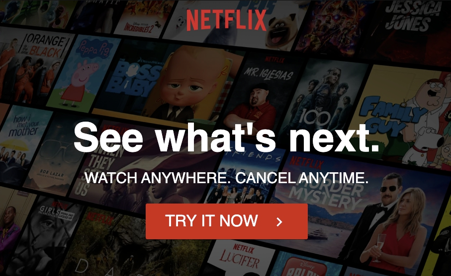

# React Netflix

## Description

Clone website Netflix (frontend) <br/>

**_DEMO:_**



## Usage / Install

Clone repo, cd into folder and run:

```console
$ npm install
$ npm start
```

## Requirement

- npm (Node) / yarn

## Tools

- create-react-app
- react-icons-kit
- react-router-dom
- styled-components
- styled-media-query


## Licence

[MIT](./LICENSE.txt)
